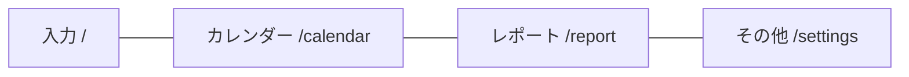

# Phase 3: レイアウト & ナビゲーション — 詳細設計書

## 概要

モバイルファーストの4画面構成（入力・カレンダー・レポート・その他）と下部タブナビゲーションを実装する。

---

## 画面構成

| パス        | 画面       | アイコン     |
| ----------- | ---------- | ------------ |
| `/`         | 入力       | `PencilLine` |
| `/calendar` | カレンダー | `Calendar`   |
| `/report`   | レポート   | `BarChart3`  |
| `/settings` | その他     | `Settings`   |

---

## ファイル構成

### コンポーネント

#### [NEW] [BottomNav.svelte](file:///home/clagon/repos/kakeibo-antigrav/src/lib/components/BottomNav.svelte)

下部タブナビゲーション。`lucide-svelte` アイコン使用。現在のパスに応じてアクティブ状態をハイライト。SvelteKit の `$page.url.pathname` で判定。

#### [MODIFY] [+layout.svelte](file:///home/clagon/repos/kakeibo-antigrav/src/routes/+layout.svelte)

`BottomNav` を配置。メインコンテンツエリアは下部ナビ分のパディングを確保。

#### [MODIFY] [layout.css](file:///home/clagon/repos/kakeibo-antigrav/src/routes/layout.css)

ナビゲーション関連のスタイルを追加。

---

### ルーティング（各画面プレースホルダー）

#### [MODIFY] [+page.svelte](file:///home/clagon/repos/kakeibo-antigrav/src/routes/+page.svelte)

入力画面の仮ページ。

#### [NEW] [/calendar/+page.svelte](file:///home/clagon/repos/kakeibo-antigrav/src/routes/calendar/+page.svelte)

カレンダー画面の仮ページ。

#### [NEW] [/report/+page.svelte](file:///home/clagon/repos/kakeibo-antigrav/src/routes/report/+page.svelte)

レポート画面の仮ページ。

#### [NEW] [/settings/+page.svelte](file:///home/clagon/repos/kakeibo-antigrav/src/routes/settings/+page.svelte)

その他画面の仮ページ。

---

## デザイン仕様

- **下部ナビ高さ**: `--spacing-nav-height` (4rem) + safe-area-inset
- **アクティブ色**: `--color-primary-500`
- **非アクティブ色**: `--color-text-muted`
- **背景**: `--color-surface` + 上部ボーダー
- **ラベル**: 日本語（入力 / カレンダー / レポート / その他）
- **アイコンサイズ**: 24px

---

## 検証

- `npm run build` 成功
- `npm run lint` パス
- 全4ルートにナビゲーションで遷移可能
- アクティブ状態が正しく切り替わる
